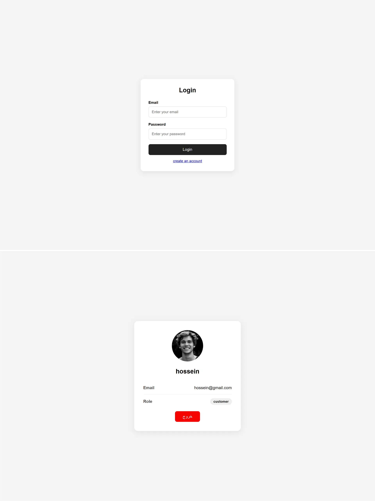

# 🔐 Login Authentication

A frontend authentication application built with **HTML, CSS, JavaScript, and Fake API**.

This project was created as a JavaScript practice project, focusing on user authentication, API requests, access tokens, refresh tokens, protected user profiles, and handling login and registration flows.

## 🚀 Features

- User registration
- User login
- Authentication using Fake API
- Access token management
- Refresh token management
- Protected profile page
- Display authenticated user's information
- Logout functionality
- Automatic access token refresh
- Store authentication tokens in Local Storage
- API integration using Fetch API

## 🛠️ Technologies

- HTML5
- CSS3
- JavaScript (Vanilla JS)
- REST API
- Fetch API
- Local Storage

## Project Preview

## Live Demo

[View Live Demo](https://hosseinmehrbakhsh.github.io/login-auth-api/)

## Author

Hossein Mehrbakhsh